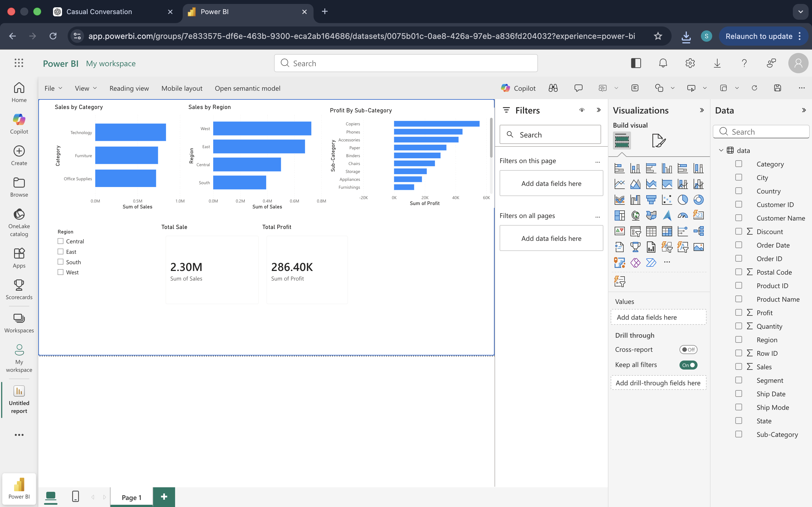

# 📊 Sales & Profit Dashboard (Power BI)

🚀 Interactive Power BI dashboard analyzing sales and profit trends across categories, sub-categories, and regions using real-world retail data.

---

## 🔍 Business Problem

Businesses often struggle to understand which products and regions drive revenue and profitability, making it difficult to optimize pricing strategies and improve decision-making.

---

## 🎯 Objective

To build an interactive dashboard that provides clear insights into sales, profit, and regional performance to support data-driven business decisions.

---

## 📈 Key Insights

* Technology category generates the highest revenue and profit
* West region performs best across all metrics
* Copiers and Phones are the most profitable sub-categories
* Higher discounts negatively impact profitability

---

## 🛠 Tools & Technologies

* Power BI (Data Visualization & Dashboarding)
* CSV Dataset (Superstore)
* Data Analysis Techniques

---

## 📊 Dashboard Features

* KPI Cards (Total Sales & Total Profit)
* Interactive Region Filter (Slicer)
* Category-wise Sales Analysis
* Sub-category Profit Breakdown
* Regional Performance Comparison

---

## 📸 Dashboard Preview

---

## 💡 Business Impact

This dashboard enables stakeholders to quickly identify high-performing areas, optimize pricing strategies, and make informed decisions using real-time insights.
